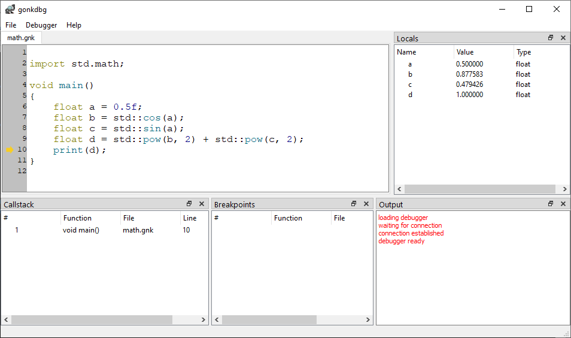

# gonk

[](https://app.travis-ci.com/strandfield/gonk)
[](https://ci.appveyor.com/project/strandfield/gonk)

`gonk` is a statically-typed scripting language written in C++17.

Its goal is not to become a fully-featured programming language but rather 
to showcase and drive the development of the [libscript](https://github.com/strandfield/libscript) 
library on which it is built.

## Getting started

### Pre-built binaries (Windows-only)

Download the latest pre-built binaries for Windows directly from GitHub in 
the [Releases](https://github.com/strandfield/gonk/releases) tab.

### Building

You will need CMake, Boost and Qt5 to build the project.

Please refer to `appveyor.yml` (Windows) or `.travis.yml` (Ubuntu) to get 
exact working commands to build the project. The steps are summarized as follow:

1. Clone the project

```bash
git clone https://github.com/strandfield/gonk.git --recursive
```

2. Build

Inside the repository, create a build dir and build with cmake.

```bash
mkdir build && cd build
cmake ..
make
```

3. Test

After a successful build, move to the test directory and run ctest.

```bash
cd tests
ctest
```

### Running a script

The syntax for running scripts with the command line is:

```bash
gonk script-name arg1 arg2 ... argN
```

Scripts have the extension `.gnk`. Examples are available in the `examples` folder.

Although `gonk` primary job is to run scripts, an interactive session can also be 
started using `gonk --interactive`:

```bash
gonk --interactive
>>> import std.math
>>> a = 0.5
0.500000
>>> b = std::cos(a)
0.877583
>>> c = std::sin(a)
0.479426
>>> std::pow(b, 2) + std::pow(c, 2)
1.000000
>>> :q
```

As this interactive session shows, `gonk` provides a module system.
Use `gonk --list-modules` to list available modules.

### Debugging

A (very) basic debugger named `gonkdbg` is also available.
Below is a screenshot of the debugger, invoked with `gonkdbg math.gnk`.



`gonkdbg` is a GUI debugger written with Qt5.

It provides the most common debugging functionalities:
- breakpoints
- step, step into, step out
- view of the callstack and local variables

The debugger communicates with `gonk` using a TCP connection.
`gonkdbg` uses the Qt class `QTcpClient` to communicate with the 
debugger server.
The debugger server uses Boost ASIO so that `gonk` itself does not 
depend on the Qt libraries.

## Creating modules

`gonk` has a module system based on plugins (see [plugins](plugins) folder).
Modules can be defined fully in C++ or with a mix of C++ / `.gnk` script.

### Exposing functions

`gonk` provides several ways to expose C++ function to the scripting system.

**Method #1: template binding functions** 

This method uses C++ templates to create functions with the following 
signature:

```cpp
script::Value callback(script::FunctionCall *c);
```

These functions can be used by the "function builders" of the scripting 
library (see [functionbuilder.h](https://github.com/strandfield/libscript/blob/master/include/script/functionbuilder.h)).

Example usage ([math.cpp](plugins/std-math/math.cpp)):

```cpp
void register_math_file(script::Namespace ns)
{
  using namespace script;

  gonk::bind::free_function<float, float, std::abs>(ns, "abs").create();
  gonk::bind::free_function<double, double, std::abs>(ns, "abs").create();

  /* ... */
}
```

Note that when exposing functions with this method, the address of the function 
is passed as a template argument.

Several function templates are provided for the different kinds of functions:
- `free_function` and `member_function` for functions
- `default_constructor` and `constructor` for constructors
- `destructor` for destructors
- and many for all operators

This method of exposing functions was the first to be introduced and relies 
on a lot of templates (see for example [memberfunction.h](include/gonk/common/binding/memberfunction.h)).
There is roughly one overload for each kind of function and number of parameters.

**Method #2: template binding functions v2** 

In this method, fewer template functions are used to expose C++ functions.
The code relies more on variadic templates.

See for example the overloads of `method()` at the end of [memberfunction.h](include/gonk/common/binding/memberfunction.h).

```cpp
template<typename R, typename T, typename...Args>
script::Function method(script::Class& cla, std::string name, R(T::*memfun)(Args...))
{
  auto impl = std::make_shared<gonk::wrapper::MethodWrapper<R, T, Args...>>(cla, std::move(name), memfun);
  script::Function ret{ impl };
  cla.addMethod(ret);
  return ret;
}
```

Unlike Method #1, the idea here is to create a class derived from 
`script::FunctionImpl` that holds the pointer to the exposed function 
and calls it in the virtual `invoke()` method. 

Example usage:

```cpp
// Before:
gonk::bind::member_function<Point, int, &Point::x>(pt, "x").get();
// After:
gonk::bind::method(pt, "x", &Point::x);
```

Note that here the function pointer that was passed as a template argument
is now passed as a simple function argument.

**Method #3: procedure name** 

The latest method for exposing functions to the scripting system is by 
declaring the functions in a script and providing the "body" in C++.
The compiler then "binds" the two by using a provided "procedure name".

Example:

In a `.gnk` script:

```cpp
[[native("custom_add")]] int add(const int& a, const int& b) = default;
```

C++ code:

```cpp
extern "C"
{

GONK_TESTHYBRIDMODULE_API int custom_add(const int& a, const int& b)
{
    return a + b;
}

} // extern "C"
```

The `gonk` compiler also needs to know the type of such functions, so for
the above example the prototype `<int, const int&, const int&>` must be 
declared before compiling the script.

See the [gonk-test-hybrid-module](plugins\gonk-test-hybrid-module) for a
working example.

## Goals and next steps

Goals:
- practising writing "complicated" templates
- writing a "plugin" system
- implementing a basic debugger

Next steps:
- the project uses a lot of templates and does not compile on Clang -> fix that!
- add a `filesystem` module
- add support for iterators and exceptions
